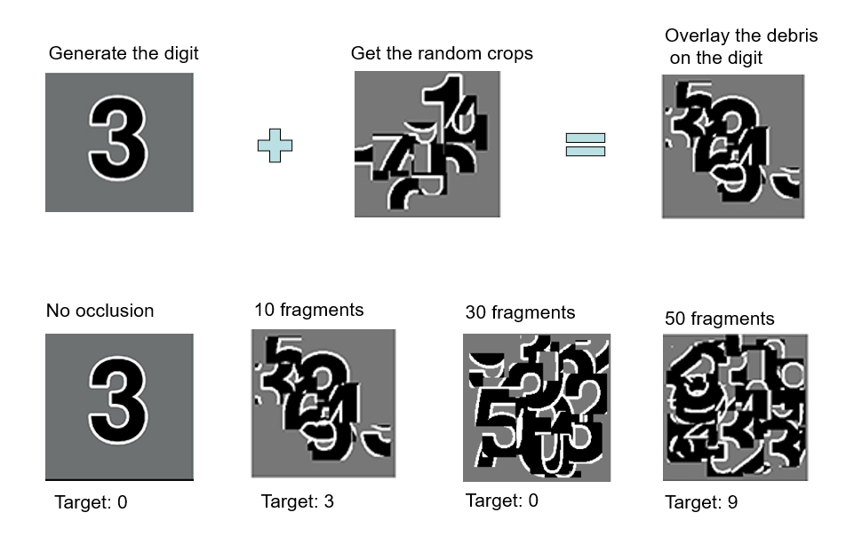
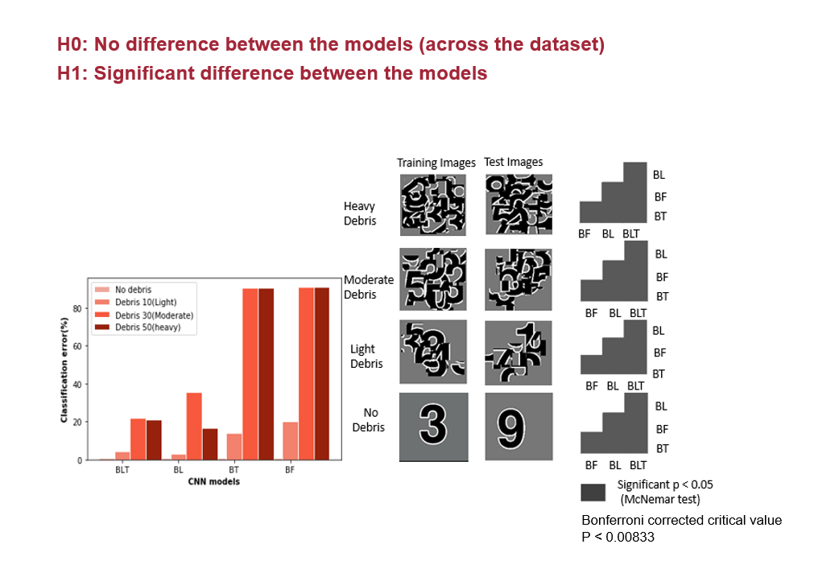
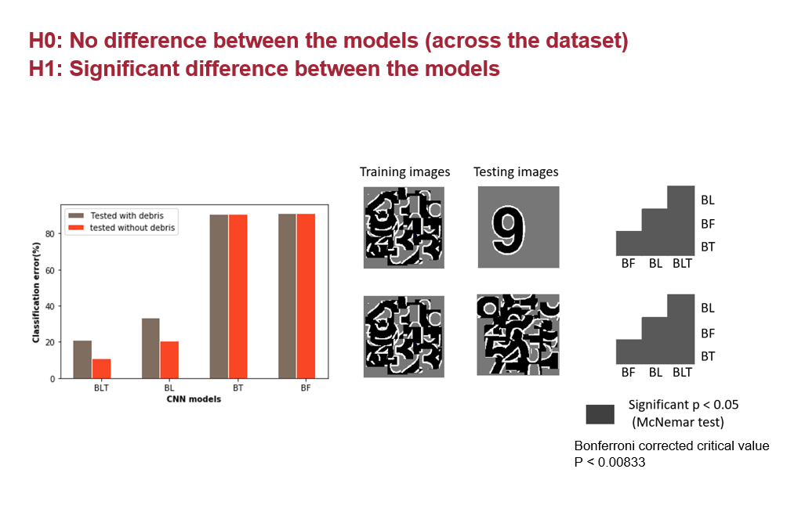

# Recurrent Convolutional Neural Networks: A Better Model of Biological Object Recognition
Implements the research paper: https://www.frontiersin.org/articles/10.3389/fpsyg.2017.01551/full 
Here I have used the Digit-debris dataset to compare the performaces of recurrent convolutional neural networks with bottom-up (B), lateral (L), and top-down (T) connections with that of the conventional CNN(feed-forward) model.

# Prerequisites
- tensorflow 2.0. 
- keras 
- numpy
- matplotlib

# Dataset:
4 types of data in Digit-debris dataset:
  - No Debris - 0 frangments(original images)
  - Light Debris - 10 fragments
  - Moderate Debris - 30 fragments
  - Heavy Debris - 50 fragments
  

# Error rates of each model 
- Percentage error increases as the number of number debris increases (BLT has the lowest error with the highest number of debris)
- Feeb-forward performs the worst with higest error rate (90%) for 50 debris
- Models with lateral connections perfomed convincingly better than feed-forward alone

| Models  | Feed-forward(%) | Lateral-BL(%) | Top-down-BT(%)| Lateral top down-BLT(%) |
| ------ | ------ | ------ | ------ | ----- | 
|No Debris | 0.649 | 0.709 | 0.919 | 0.668 | 
|Light Debris(10)| 19.50 | 2.969 | 14.11 | 4.549 | 
|Moderate Debris(30)| 91 | 12.650 | 90.5 | 21.697 |
|Heavy Debris(50) | 91 | 16.708 | 90.53 | 21.11|

# Learning to Recognize Digits Occluded by Debris
Classification error for all models on single digit detection under varying levels of debris. Examples of the images used to train and test the networks are also shown. Matrices to the right indicate significant results of pairwise McNemar tests. Comparisons are across models and within image sets. Black boxes indicate significant differences at p < 0.05 when controlling the expected false discovery rate at 0.05.

# Learning to Recognize Unoccluded Digits When Trained with Occlusion
Classification error for all models trained under heavy debris conditions and tested with or without debris. Examples of the images used to train and test the networks are also shown. Matrices to the right indicate significant results of pairwise McNemar tests. Comparisons are across models and within image sets. Black boxes indicate significant differences at p < 0.05 when controlling the expected false discovery rate at 0.05.

